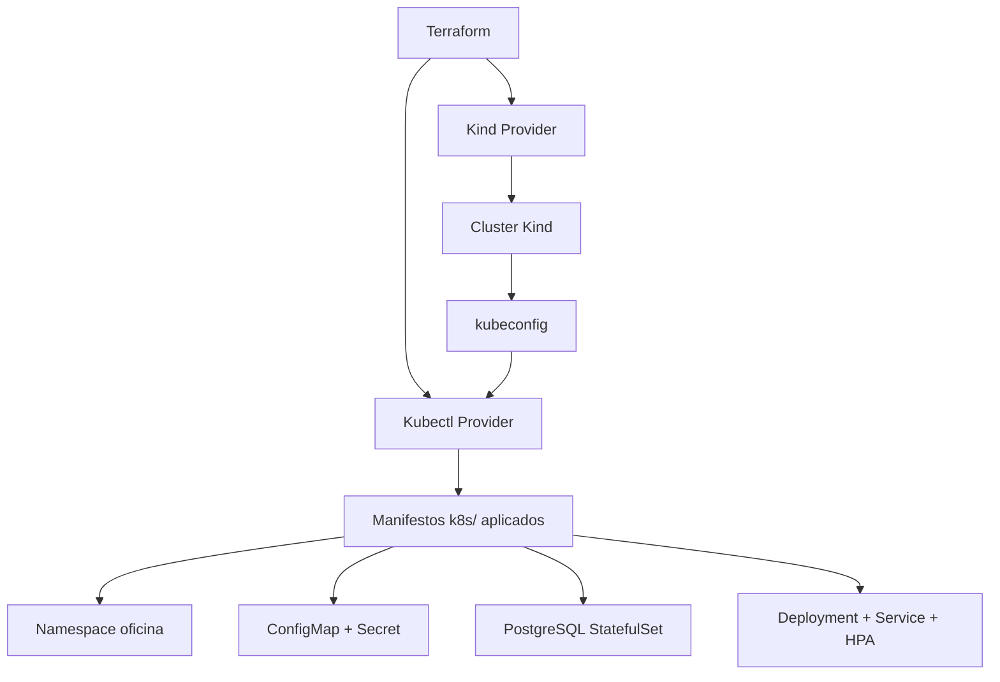

# Terraform para Cluster Local Kind + PostgreSQL

## Objetivo

Provisionar um cluster Kubernetes local (Kind) e todos os recursos do projeto (aplicação, banco, etc.) exclusivamente via Terraform, eliminando comandos kubectl manuais.

## Arquitetura



## Providers

| Provider | Versão | Função |
|----------|--------|--------|
| `hashicorp/null` | ~> 3.2 | Executar comandos `kind` via `local-exec` |
| `gavinbunney/kubectl` | ~> 1.14 | Aplicar manifestos YAML |

> **Nota:** O provider `justindbud/kind` não está publicado no Terraform Registry.
> A alternativa usando `null_resource` com `local-exec` é a abordagem padrão
> para provisionar clusters Kind via Terraform.

## Recursos Provisionados

### Cluster (kind.tf)
- Cluster Kind `tech-challenge` via `null_resource` + `local-exec`
- Node control-plane único (single-node cluster)
- Destruição automática via `destroy` provisioner

### Kubernetes (manifests.tf)
- **Namespace** `oficina`
- **ConfigMap** `oficina-config`
- **Secret** `oficina-secrets`
- **PostgreSQL** StatefulSet + PVC 10Gi + Service ClusterIP
- **Deployment** `oficina-api` (3 réplicas)
- **Service** `oficina-api` (ClusterIP porta 80)
- **HPA** `oficina-api-hpa` (2-10 pods, CPU 70%, memória 80%)

### Dependências entre recursos

Cada `kubectl_manifest` declara `depends_on` explícito para garantir a ordem correta:
- Namespace é criado primeiro
- ConfigMap e Secret dependem do Namespace
- PostgreSQL depende do Namespace + Secret
- Deployment depende do Namespace + ConfigMap + Secret + PostgreSQL
- Service depende do Namespace + Deployment
- HPA depende do Deployment

## Arquivos

| Arquivo | Descrição |
|---------|-----------|
| `versions.tf` | Providers e versões do Terraform |
| `kind.tf` | Recurso `kind_cluster` |
| `manifests.tf` | Aplicação dos manifestos YAML do diretório `k8s/` |
| `variables.tf` | Variáveis de configuração |
| `terraform.tfvars` | Valores default |
| `README.md` | Documentação de uso |

## Pré-requisitos

- Docker
- Kind CLI
- Terraform 1.6+

## Uso

```bash
cd terraform
terraform init
terraform apply
```

Para acessar a API após provisionamento:

```bash
kubectl port-forward -n oficina svc/oficina-api 8080:80
# Acessar http://localhost:8080/docs
```

## Destruição

```bash
terraform destroy
```

Isso remove todos os recursos Kubernetes e o cluster Kind.
